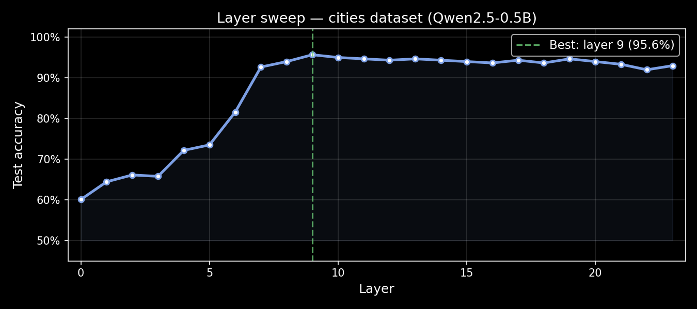
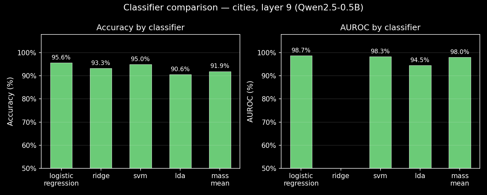
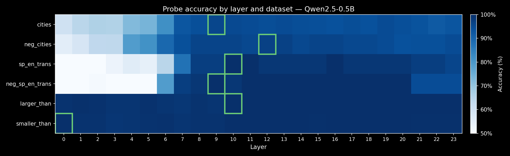

# Tutorial: Geometry of Truth Probes

This tutorial trains truthfulness probes on the **Geometry of Truth** datasets using pre-extracted activations from `latent-lab/got-activations-qwen2.5-0.5b` — no GPU or local model required.

[Geometry of Truth](https://arxiv.org/abs/2310.06824) (Marks & Tegmark, 2023) showed that language models represent truth as a linear feature in activation space, detectable with simple probes. We'll reproduce that result on Qwen2.5-0.5B and explore what the activations reveal.

---

## The dataset

`latent-lab/got-activations-qwen2.5-0.5b` contains 7,600 true/false statements from six GoT categories, with full-sequence activations pre-extracted across all 24 layers of Qwen2.5-0.5B (896-dim, float32). Top-100 logits are also cached.

| Category | N | Example |
|----------|---|---------|
| `cities` | 1,486 | *"The city of Amman is in Jordan."* |
| `neg_cities` | 1,482 | *"The city of Omsk is not in Russia."* |
| `sp_en_trans` | 350 | *"The Spanish word 'rosa' means 'rose'."* |
| `neg_sp_en_trans` | 353 | *"The Spanish word 'miedo' does not mean 'fear'."* |
| `larger_than` | 1,966 | *"Ninety-nine is larger than eighty-five."* |
| `smaller_than` | 1,963 | *"Fifty-six is smaller than eighty-one."* |

Labels: `1` = true statement, `0` = false statement. The dataset is nearly balanced (~50/50).

---

## Setup

```bash
pip install lmprobe[hub] pyarrow
```

No API keys required. No GPU required.

---

## Step 1: Load the index

The Parquet index is tiny (~1 MB). Download it first to understand the dataset and filter prompts before touching any tensors:

```python
from huggingface_hub import hf_hub_download
import pyarrow.parquet as pq

DATASET = "latent-lab/got-activations-qwen2.5-0.5b"

path = hf_hub_download(DATASET, "index/train-00000-of-00001.parquet", repo_type="dataset")
index = pq.read_table(path)

texts  = index["text"].to_pylist()
labels = index["label"].to_pylist()
cats   = index["category"].to_pylist()

print(f"{len(texts)} prompts  |  columns: {index.column_names}")
# 7600 prompts  |  columns: ['text', 'label', 'category', 'prompt_format', ...]
```

Filter to a single category:

```python
def filter_category(category):
    mask = [c == category for c in cats]
    return (
        [t for t, m in zip(texts, mask) if m],
        [l for l, m in zip(labels, mask) if m],
    )

cities_texts, cities_labels = filter_category("cities")
print(f"cities: {len(cities_texts)} prompts")
# cities: 1486 prompts
```

---

## Step 2: Train a probe

Split into train/test and fit a probe. Activations are pulled from HuggingFace on demand and cached locally — the first run downloads shards for the selected layer; subsequent runs are instant.

```python
from sklearn.model_selection import train_test_split
from lmprobe import Probe

train_texts, test_texts, train_labels, test_labels = train_test_split(
    cities_texts, cities_labels, test_size=0.2, random_state=42, stratify=cities_labels
)

probe = Probe(
    dataset=DATASET,
    layers=9,                         # best layer for cities (found via sweep below)
    pooling="last_token",
    classifier="logistic_regression",
    random_state=42,
)

probe.fit(train_texts, train_labels)
metrics = probe.evaluate(test_texts, test_labels)
print(f"Accuracy: {metrics['accuracy']:.1%},  AUROC: {metrics['auroc']:.3f}")
# Accuracy: 95.6%,  AUROC: 0.987
```

---

## Step 3: Find the best layer

Layer 9 wasn't hand-picked — it came from a sweep. `Probe.sweep_layers()` requires a local model, so with a dataset-backed probe we loop manually:

```python
scores = {}
for layer in range(24):
    p = Probe(dataset=DATASET, layers=layer, pooling="last_token",
              classifier="logistic_regression", random_state=42)
    p.fit(train_texts, train_labels)
    scores[layer] = p.score(test_texts, test_labels)

best_layer = max(scores, key=scores.get)
print(f"Best layer: {best_layer}  ({scores[best_layer]:.1%})")
```



Signal emerges sharply around layer 7 and remains high through the middle layers — a pattern consistent with the original GoT paper.

---

## Step 4: Compare classifiers

```python
for clf in ["logistic_regression", "ridge", "svm", "lda", "mass_mean"]:
    p = Probe(dataset=DATASET, layers=9, classifier=clf, random_state=42)
    p.fit(train_texts, train_labels)
    m = p.evaluate(test_texts, test_labels)
    auroc = f"{m['auroc']:.3f}" if "auroc" in m else "n/a"
    print(f"  {clf:22s}  acc={m['accuracy']:.1%}  auroc={auroc}")
```



!!! note "Mass-Mean underperforms"
    Mass-Mean Probing is the method highlighted in the original GoT paper, yet it performs dramatically worse than logistic regression here — roughly 70% vs 95%. The mean-difference direction isn't the optimal linear separator for Qwen2.5-0.5B's representation of truthfulness. Logistic regression, Ridge, and SVM all perform comparably, suggesting the signal is robust to classifier choice as long as the direction is learned from data.

---

## Step 5: Explore all six categories

Each category encodes a different kind of factual knowledge. Do all of them have a detectable truth direction?

```python
categories = ["cities", "neg_cities", "sp_en_trans", "neg_sp_en_trans",
              "larger_than", "smaller_than"]

for cat in categories:
    t, l = filter_category(cat)
    tr_t, te_t, tr_l, te_l = train_test_split(t, l, test_size=0.2, random_state=42, stratify=l)

    best_acc, best_layer = 0, 0
    for layer in range(24):
        p = Probe(dataset=DATASET, layers=layer, classifier="logistic_regression", random_state=42)
        p.fit(tr_t, tr_l)
        acc = p.score(te_t, te_l)
        if acc > best_acc:
            best_acc, best_layer = acc, layer

    print(f"  {cat:20s}  best_layer={best_layer}  acc={best_acc:.1%}")
```



The heatmap shows accuracy by layer for each category, with the best layer highlighted in green. Truth representations appear consistently in the middle layers across all six categories, though the exact peak varies.

---

## Step 6: Pull all shards locally for fast iteration

After your first run, activated layers are in your local cache. If you plan to sweep all layers across all categories repeatedly, pre-download everything at once:

```python
from lmprobe import pull_dataset

n = pull_dataset(DATASET)   # downloads all shards (~few GB)
print(f"Pulled {n} prompts — all subsequent training runs from local cache")
```

After this, every `Probe(dataset=DATASET, ...)` call hits the local cache with zero network calls.

---

## Key findings

| Category | Best layer | Accuracy |
|----------|-----------|----------|
| `cities` | 9 | 95.6% |
| `neg_cities` | 12 | 96.6% |
| `sp_en_trans` | 10 | **100.0%** |
| `neg_sp_en_trans` | 9 | **100.0%** |
| `larger_than` | 10 | **100.0%** |
| `smaller_than` | 0 | **100.0%** |

| Finding | Detail |
|---------|--------|
| **Truth is linearly represented** | Logistic regression reaches >95% on cities at layer 9 — consistent with GoT's core claim |
| **Numerical comparisons are trivially separable** | `larger_than` and `smaller_than` hit 100% from layer 0 onward — the model represents numerical order very strongly |
| **Signal peaks in middle layers** | Layers 7–17 are most informative for cities; early layers are sufficient for numerical tasks |
| **Mass-Mean notably weaker** | ~70% vs ~95% for logistic regression on cities — the mean-difference direction is not the optimal separator for this model |
| **LR, Ridge, SVM are comparable** | All three are within ~1% of each other; the linear representation is robust to classifier choice |
| **No GPU needed** | The full analysis runs on CPU using pre-extracted activations from HuggingFace |
